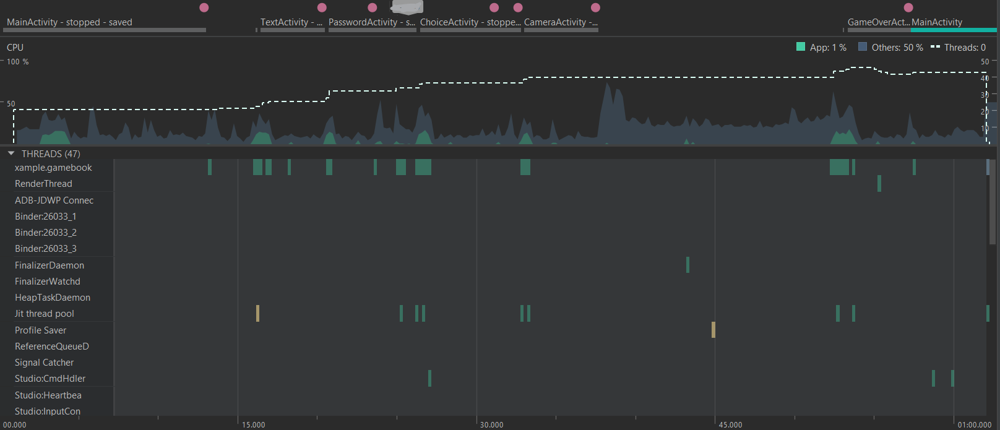

# CPU

O aplicativo faz uso da CPU durante a troca das activities e quando abrimos a camera para capturar uma imagem (representado pelo pico de uso da cpu por outras aplicações visto no gráfico abaixo). Além disso, um pequeno aumento quando a imagem é processada pelo TensorFlow.

## Estratégias para melhorar desempenho
Para evitar que o usuário voltasse para uma cena que ele já tomou uma decisão, optamos por destruir as Activities depois de tê-la completado.

Como o uso da CPU é pontual durante criação e destruição de Activities, talvez evitar destruir elas e reaproveita-las, mudando apenas seu conteúdo, diminua os picos de uso, mas com isso podemos aumentar o uso de memória e recursos em geral de forma contínua.