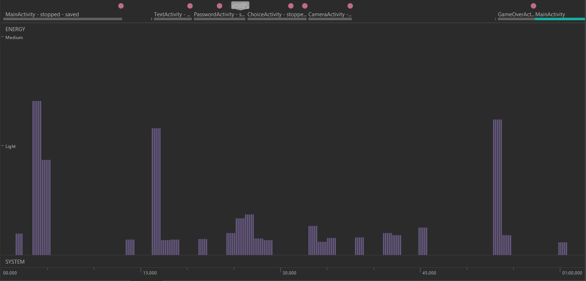

# Bateria

O uso de bateria aumenta devido ao uso de CPU, com curtos picos devido a troca das Activities. No entanto, como nossa aplicação é bastante baseada em leitura de texto, estes picos não devem ser tão frequentes.

Além do pico de energia no início da aplicação, em particular temos um quando é feito a leitura do JSON e durante o uso do TensorFlow.

