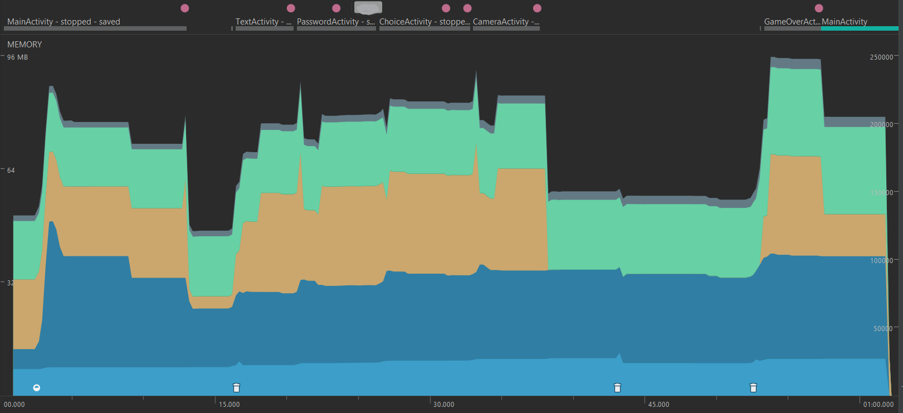

# Memória

O uso de memória pela aplicação se mantem bastante constante, aumentando apenas quando é preciso exibir as Activities. Em particular, podemos observar uma região onde, quando chamamos a aplicação de câmera, a memória de vídeo é usada pela mesma.

## Leak Canary
Após uso exaustivo, o Leak Canary não encontrou vazamentos de memória